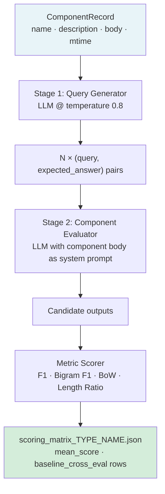
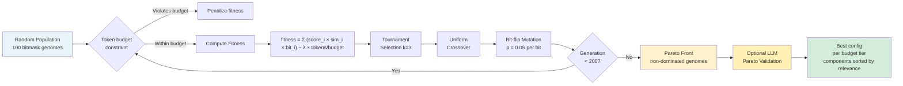
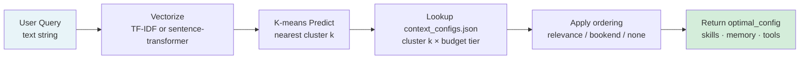
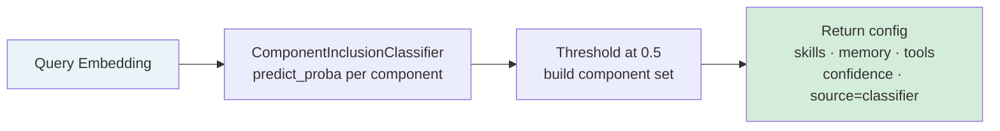
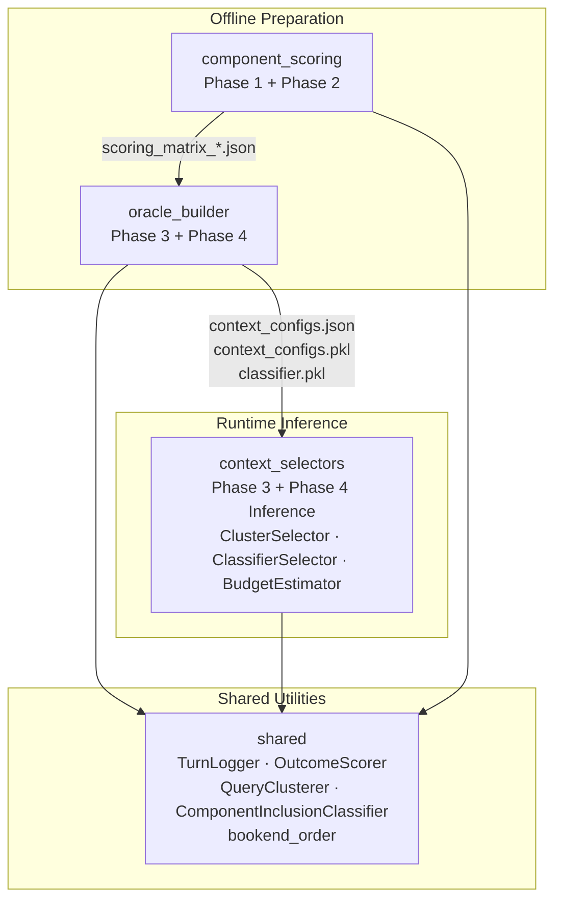
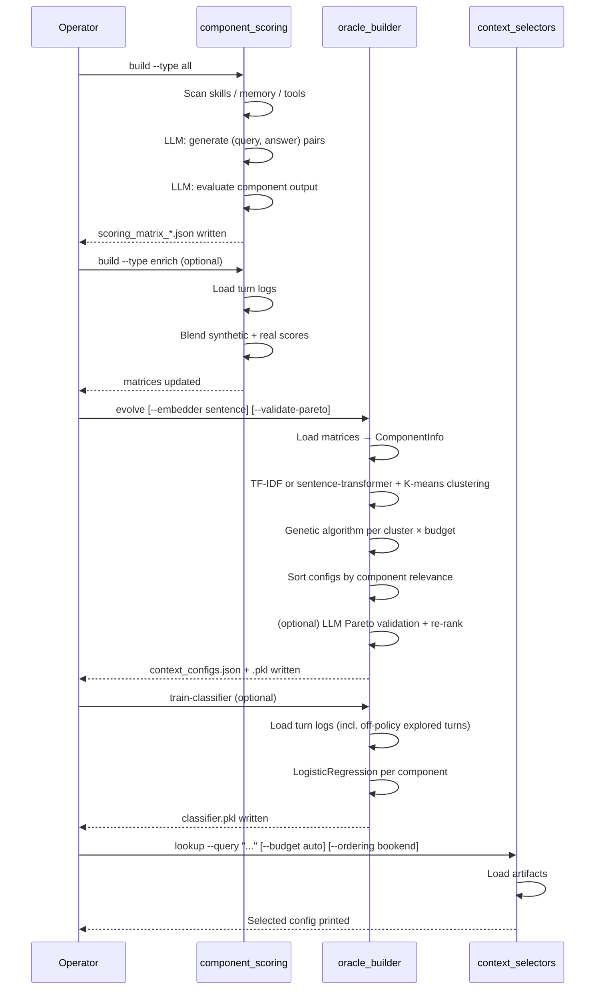
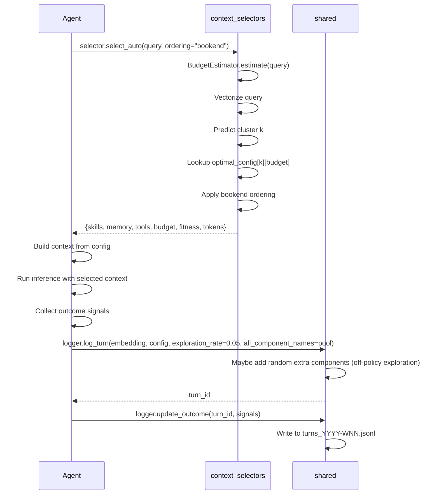

# THALAMUS: Adaptive Context Selection for AI Agents

**[Author names redacted for review]**
*Preprint. Under review.*

---

## Abstract

Production AI agents do not select their own context. The standard approach is uniform inclusion: every skill document, every memory section, and every tool definition is loaded into the context window for every query — regardless of whether it is relevant. This works at small scale. It breaks at production scale. We name the structural cost it creates **Context Saturation**: as the number of available components grows, the context window fills with irrelevant instructions, the signal-to-noise ratio of the agent's input degrades, and token cost scales linearly with the component library — not with what the query actually needs.

**THALAMUS** is a four-phase adaptive context selection system that closes this gap. Its offline preparation pipeline uses LLM-driven evaluation to produce scored matrices for every skill, memory section, and tool in the agent's library, blends those synthetic scores with real interaction evidence, then runs a genetic algorithm — with no LLM calls — to find optimal component combinations for every query type and token budget. An optional end-to-end Pareto validation step re-evaluates the genetic algorithm's best candidates with real LLM calls before committing to a configuration, correcting the gap between proxy fitness and actual combination utility. Its runtime selection layer assigns each incoming query to the nearest cluster — using either TF-IDF or semantic sentence-transformer embeddings — and retrieves the precomputed optimal configuration in under ten milliseconds. Components within each retrieved configuration are stored in relevance order and may be further rearranged with a bookend ordering strategy that places the most-relevant items at the edges of the context window, mitigating the lost-in-the-middle attention decay documented in long-context models. When the caller does not specify a budget level, a lightweight heuristic estimator infers it from query characteristics. After sufficient operational data accumulates, a supervised classifier trained on logged turn outcomes refines the cluster-based assignment with per-component probability estimates; an off-policy exploration mechanism ensures the classifier is exposed to counterfactual component inclusions, correcting the selection bias that arises when training only on the components the selector already chose. At every stage, the system degrades gracefully: it falls back to the nearest available strategy when data is insufficient, and it never requires LLM calls at query time. This paper presents the complete design: the problem it solves, the architecture that solves it, and the rationale for every structural decision.

---

## 1. Introduction

An agent's context window is a finite resource. At query time, the agent receives a system prompt assembled from some combination of skill instructions, memory sections, and tool definitions — and reasons over all of it simultaneously. In early deployments, the library of available components is small enough that loading all of them creates no measurable problem. The context window is not saturated. The irrelevant instructions do not dominate. Token costs are acceptable.

This state does not persist. As a production agent accumulates skills — each a multi-paragraph instruction document addressing a specific domain — and as memory files grow to encode project architecture, user preferences, team conventions, and operational constraints, and as the tool library expands to cover infrastructure, APIs, and data systems, the cost of the uniform-inclusion strategy grows. The context window fills with instructions for tasks the current query has nothing to do with. The LLM's attention is distributed across a growing mass of irrelevant text. Relevant instructions compete for weight with unrelated ones. Token costs for every query scale with the total library size, not with query complexity.

We name this structural failure **Context Saturation**. It is not a latency problem or a cost problem in isolation — it is a quality problem. A context window dominated by irrelevant text produces worse answers on the relevant task. The agent that knows everything about deploying microservices is not better at answering a question about writing unit tests because both skill documents are loaded. It is worse, because the microservices instructions now compete with the testing instructions for the finite attention that determines what the model treats as salient.

The structurally correct response is to match the context to the query: load the components that are relevant to what is being asked, and leave the others out. This is easy to state and hard to implement correctly. The naive solution — keyword matching between the query and skill titles — fails on paraphrase, on implied context, and on any case where the relevant skill has a name that does not appear verbatim in the query. A more principled approach requires knowing, for each possible query type, which components actually help an agent produce good outputs — and knowing this before the query arrives, so that selection adds no latency.

**THALAMUS** is a system built to provide exactly this. Its name follows the analogy to the biological thalamus, the neural relay station that filters sensory input before forwarding it to the cortex. The system operates in four phases. In the offline preparation stage, it uses a language model to generate synthetic evaluation data for every component, measuring each component's contribution to output quality across a representative sample of query types. It blends this synthetic evidence with real interaction data as operational logs accumulate. It then runs a genetic algorithm — entirely without LLM calls — that searches over bitmask combinations of components, finding the Pareto-optimal selection for each query cluster and token budget. An optional validation pass re-evaluates the Pareto front with direct LLM calls, correcting for combination-level synergies that the proxy fitness function cannot capture. The result is a precomputed lookup table: given a query cluster and a budget, retrieve the optimal component set instantly, with components stored in descending relevance order ready for bookend rearrangement. A second offline stage trains a logistic regression classifier on logged turn outcomes, refining the cluster assignment with per-component probability estimates once sufficient data exists; off-policy exploration during logging ensures the classifier encounters counterfactual inclusions, not just the components the selector already favored. At query time, both inference paths complete in milliseconds.

This paper makes the following contributions:

- **A Structural Diagnosis of Context Saturation (§3):** A formal characterization of how uniform context inclusion fails at scale, and why the structural response requires both offline preparation and fast runtime lookup rather than query-time LLM reasoning.
- **A Multi-Phase Evaluation Pipeline (§4):** A two-stage LLM-driven scoring protocol that generates synthetic (query, answer) pairs for each component and evaluates the component's output against four lexical metrics, producing a scored matrix that captures per-component relevance signal without requiring a live agent.
- **A Genetic Algorithm for Context Optimization (§5):** A population-based bitmask search over component combinations, with a fitness function that jointly optimizes relevance-weighted quality and token efficiency, producing Pareto-optimal configurations for each query cluster and budget level. An optional end-to-end LLM validation step re-ranks the Pareto front using real quality scores before the best config per budget is committed.
- **A Supervised Classifier Refinement Layer (§6):** A logistic regression model trained on logged agent turns that predicts per-component inclusion probability from query embeddings, refining cluster-based selection with continuous evidence from real interactions. Off-policy exploration during turn logging corrects the selection bias that arises when training exclusively on observed inclusions.
- **A Graceful Fallback Architecture (§7):** A runtime selection design that guarantees a valid selection at every stage of the system's maturity, from initial deployment with no operational data through full classifier convergence.
- **Context-Aware Ordering (§7.1):** A bookend component ordering strategy that counteracts the lost-in-the-middle attention decay in long-context models by placing the most-relevant components at the edges of each context list.
- **Automatic Budget Estimation (§7.1):** A lightweight heuristic estimator that infers the appropriate token budget from query characteristics, allowing callers to omit explicit budget specification.

Section 2 establishes the context. Section 3 formalizes the problem. Sections 4–6 present each pipeline phase. Section 7 describes the runtime selection architecture. Section 8 covers the complete system design. Section 9 discusses limitations. Section 10 concludes.

---

## 2. Background

### 2.1 Context Windows as Finite Compute

Transformer-based language models process their input with attention mechanisms whose computational cost scales quadratically with sequence length. In practice, the effective quality of model output degrades before the hard token limit is reached: as context grows, the signal from any specific span of text is progressively diluted by the surrounding volume. Work on long-context modeling has consistently found that models attend preferentially to text near the beginning and end of the context window, with material in the middle receiving substantially lower effective weight [Liu et al., 2024]. For an agent whose most relevant skill document appears in position 12 of a 30-document context, this is a structural liability.

The practical consequence for agentic systems is that context assembly — the selection and ordering of what the agent receives — is not a formatting concern. It is a performance determinant. An agent that receives a well-matched, compact context performs better on the task than an agent that receives the same relevant content surrounded by unrelated instructions of equal or greater volume. And among agents that have already selected the right components, the one that places them at the edges of the context window — rather than in the middle — benefits from stronger attentional weight on the most relevant material.

### 2.2 Retrieval-Augmented Generation

Retrieval-augmented generation (RAG) [Lewis et al., 2020] established the principle of dynamic context inclusion: rather than embedding all available knowledge in a static system prompt, retrieve the relevant subset at query time using a similarity function over a document index. RAG systems use dense vector retrieval — typically cosine similarity over embedding vectors — to identify the documents most semantically similar to the query.

Direct RAG over skill documents has two structural limitations for agentic systems. First, skill documents are not self-contained answers — they are procedural instructions whose value depends on whether the agent is performing the task described, not on whether the query text resembles the skill title or description. A skill for setting up a CI pipeline may be the most relevant skill for a query phrased as "automate my tests", but a naive similarity search between "automate my tests" and "CI pipeline setup" may score it poorly relative to a skill titled "automated testing". Second, RAG retrieves documents independently — it does not reason about the interaction between a set of selected documents. A skill selection problem is fundamentally a set optimization problem, not a ranking problem.

### 2.3 Context Optimization as Combinatorial Search

The problem of selecting which context components to include is equivalent to a subset selection problem over a combinatorial space. Given *N* available components, there are 2^N possible subsets. For a production agent with 50 components, this is over 10^15 combinations — too large for exhaustive search. Greedy approaches (add components in order of relevance until the budget is filled) are fast but cannot reason about component interactions or token constraints jointly. Population-based search methods — genetic algorithms, evolutionary strategies — have been shown to find good approximate solutions to combinatorial optimization problems of this scale [Holland, 1975] with tractable compute budgets when the fitness function is cheap to evaluate.

The key insight behind THALAMUS is that fitness evaluation for context selection *can* be made cheap offline. By precomputing relevance scores for each component from LLM-generated evaluation data, and by precomputing cluster assignments for the space of plausible query types, the fitness function at search time is a simple dot product and arithmetic operation — no LLM calls required. This makes large-scale evolutionary search over component combinations computationally feasible.

---

## 3. The Problem: Context Saturation

We formalize the context selection problem as follows.

Let *C* = {*c*₁, *c*₂, ..., *c_N*} be the set of available context components. Each component *c_i* has a body *b_i* (its text, measured in tokens as *t_i*) and a relevance signal *r_i*(*q*) that depends on the incoming query *q*. Agent output quality for query *q* is a function *Q* = *f*(*q*, *S*, *M*), where *S* ⊆ *C* is the selected context subset and *M* is the model. The context selection problem is:

> Find *S\** = argmax_{S ⊆ C} *Q*(*q*, *S*) subject to Σ_{c_i ∈ S} *t_i* ≤ *B*

where *B* is the token budget.

**Uniform Inclusion** sets *S* = *C* at all times and all budgets. This is optimal only in the degenerate case where every component is relevant to every query, which is false for any non-trivial component library.

**Context Saturation** is the structural consequence of uniform inclusion as *N* grows. Three effects compound:

1. **Attention Dilution.** For a fixed query *q*, the effective weight of relevant component *c_j* in determining agent output decreases as |*S*| increases — because attention is distributed over a larger input volume. The agent that could correctly apply *c_j* when it is the only document in context may fail to apply it when it is document 23 of 40.

2. **Token Cost Scaling.** Under uniform inclusion, the token cost of every query scales as Σ *t_i* over all *N* components — independent of query complexity or relevance. For a library of 50 skills averaging 500 tokens each, this is 25,000 tokens of system prompt per query, regardless of whether one or all fifty skills are relevant.

3. **Noise-to-Signal Inversion.** When the number of irrelevant components exceeds the number of relevant ones — the normal case for a large library — the majority of the context window actively works against the agent's performance on the relevant task. Instructions for unrelated workflows compete with instructions for the actual task.

The solution space is not a better retrieval algorithm operating at query time. Query-time retrieval introduces latency, requires an embedding model at inference, and cannot reason about component interactions or budget constraints as a set optimization problem. The solution space is **offline preparation**: precompute, for each query type and token budget, the optimal component subset — then look it up at query time.

---

## 4. Phase 1 — Component Scoring

The first phase of THALAMUS's offline pipeline converts each context component into a scored matrix: a record of how well that component enables an agent to produce correct outputs across a sample of representative queries.

### 4.1 Component Types

THALAMUS recognizes three categories of context components:

| Category | Source | Scanner |
|----------|--------|---------|
| **Skills** | `SKILL.md` files in skill subdirectories | Directory walk, one component per skill folder |
| **Memory sections** | Markdown files (`project.md`, `user.md`, etc.) split by `##` heading | Section parser, one component per heading |
| **Tools** | Python source files containing `Tool*` class definitions | AST-based class discovery |

Each component is represented as a `ComponentRecord` containing its name, a one-line description, its full body text, source file path, and modification timestamp. The modification timestamp drives incremental rebuilding: THALAMUS computes a SHA-256 fingerprint over (name, description, mtime) and skips evaluation for any component whose fingerprint matches the saved state from the previous build.

### 4.2 Two-Stage LLM Evaluation

Scoring each component requires answering the question: "If an agent has this component in its context, how much better does it answer queries that this component is relevant to?" THALAMUS answers this with a two-stage LLM protocol.

**Stage 1 — Query Generation.** Given a component body, a language model generates *N* realistic (query, expected\_answer) pairs representing cases where the component would be useful. Generation uses temperature 0.8 to produce diverse coverage. Pairs with fewer than 10 characters in the query or 5 characters in the expected answer are filtered out. The default is 20 pairs per component; this is configurable.

**Stage 2 — Component Evaluation.** For each generated pair, THALAMUS runs a second LLM call: the component body is used as the system prompt, the query is the user message, and the model's response is the candidate output. The candidate output is then scored against the expected answer using four lexical metrics:

```
F1             = 2 × (precision × recall) at the token level
Bigram F1      = same computation over 2-gram token sequences
Bag of Words   = word overlap ratio, order-independent
Length Ratio   = min(|output|, |expected|) / max(|output|, |expected|)
```

The mean of these four scores across all *N* pairs becomes the component's `mean_score` — its synthetic relevance signal. The full matrix of (query, expected, candidate, scores) rows is written to `scoring_matrix_<type>_<name>.json`. This file is the primary artifact of Phase 1.

**Evaluation is purely lexical** at this stage, which is a deliberate design choice. The goal is not to evaluate semantic correctness in depth — it is to produce a relative ordering signal that the genetic algorithm can use to compare components. Lexical overlap metrics are cheap to compute, require no additional LLM calls at search time, and have been shown to correlate adequately with output quality rankings at the population level [Papineni et al., 2002]. The system does not need a perfect quality estimate; it needs a signal that directs evolutionary search toward better component sets.



### 4.3 Change Detection and Incremental Builds

Running a full two-stage LLM evaluation for every component on every build would be prohibitively slow for large libraries. THALAMUS implements incremental evaluation: a `MatrixState` file records the fingerprint and build timestamp for each component. On subsequent builds, only components whose fingerprints have changed — because their body text, name, or source file modification time has changed — are re-evaluated. Components that have not changed reuse their existing matrix files. The `--force` flag bypasses this and rebuilds all components.

---

## 5. Phase 2 — Score Enrichment

Synthetic scores derived from LLM self-evaluation are an approximation. The language model generating the (query, answer) pairs may not cover the full distribution of queries that appear in production. The model evaluating candidates against expected answers applies its own implicit quality model, which may not match actual user satisfaction. Phase 2 corrects for these limitations by blending synthetic scores with real interaction evidence.

### 5.1 Turn Logging

During live operation, THALAMUS logs each agent turn as a structured record in a weekly JSONL file:

```json
{
  "turn_id": "<uuid>",
  "timestamp": "2025-01-14T09:12:00Z",
  "query_embedding": [0.12, -0.34, ...],
  "context_config": {
    "skills": ["devops-toolkit"],
    "memory": ["project.md::Architecture"],
    "tools": ["bash_exec"]
  },
  "outcome": {
    "explicit_rating": null,
    "implicit_signals": {
      "task_completed": true,
      "follow_up_correction": false,
      "conversation_length": 3
    },
    "component_usage": {
      "skills_used": ["devops-toolkit"],
      "tools_called": ["bash_exec"]
    }
  }
}
```

The outcome quality for each turn is computed as a scalar in [0, 1]:

```
quality = 0.5
        + 0.20  if task_completed
        − 0.30  if follow_up_correction
        + max(0, 0.10 − 0.02 × conversation_length)
        clamped to [0.0, 1.0]
```

Explicit ratings override this formula: a logged "positive" rating maps to 1.0, "negative" to 0.0.

**Off-policy exploration.** A standard logging policy records only the components that the selector actually chose. The Phase 4 classifier trained on such logs learns only from observed inclusions and cannot learn to include components it has never seen selected — a classic off-policy bias. To correct for this, `TurnLogger.log_turn` accepts an `exploration_rate` parameter and an `all_component_names` pool. When `exploration_rate > 0`, each unselected component in the pool is independently added to the actual context for that turn with probability equal to the rate. Explored turns are flagged in the log record with `"exploration": {"explored": true, "exploration_rate": ..., "explored_additions": {...}}` so the classifier trainer can identify them and apply appropriate weighting. Typical values are 0.05–0.10: low enough not to visibly degrade agent quality on explored turns, high enough to accumulate counterfactual evidence within a few hundred turns.

### 5.2 Bayesian Blending

The `ScoreEnricher` reads all available turn logs for each component and applies a soft Bayesian blend between the synthetic prior and the real evidence:

```
n_real            = number of turns where component c was in context
synthetic_weight  = max(0, 1 − n_real / n_needed)
real_weight       = 1 − synthetic_weight
updated_mean      = synthetic_weight × synthetic_mean
                  + real_weight × mean(real_outcome_scores)
```

The `n_needed` threshold (default: 100 turns) controls how quickly real evidence displaces the synthetic prior. When no real data exists, `updated_mean` equals `synthetic_mean` — the synthetic score is used unchanged. As real data accumulates, the weight shifts toward the empirical mean. This prevents early noisy real samples from overriding a reasonably calibrated synthetic estimate.

Phase 2 is optional. The rest of the pipeline runs correctly whether or not enrichment has been applied.

---

## 6. Phase 3 — Evolutionary Oracle Building

Phase 3 is the core offline optimization stage. It takes all component scoring matrices and produces `context_configs.json`: a lookup table mapping (query cluster, budget) to an optimal component subset.

This phase makes no LLM calls in standard mode. The entire computation runs on the precomputed scores from Phase 1.

### 6.1 Query Clustering

Before searching for optimal component sets, THALAMUS needs a partition of the query space. It cannot optimize separately for every possible query — but it can optimize for every cluster of similar queries.

The clustering procedure uses all `example_input` texts extracted from the scoring matrices across all components. These texts represent the space of queries that the component library was designed to handle. THALAMUS supports two embedding backends for vectorizing these texts before K-means clustering:

**TF-IDF (default).** A TF-IDF vectorizer with a configurable vocabulary (default: 2000 features) followed by K-means with *K* clusters (default: 20). Fast, requires no external dependencies, and works well when the training corpus and production queries share vocabulary. Because TF-IDF is bag-of-words, it will fail to cluster paraphrase variants that share meaning but not lexical form.

**Sentence transformer (optional).** When `--embedder sentence` is passed, THALAMUS uses a sentence-transformer model (default: `all-MiniLM-L6-v2`) to produce dense semantic embeddings normalized to unit length before K-means. This produces paraphrase-robust clusters at the cost of a slower build and an additional dependency (`sentence-transformers`). The embedding model name is persisted in the output so the runtime can reload it for consistent prediction at query time.

For each component, THALAMUS also computes a **query centroid**: the mean embedding vector over all of that component's example input texts, using the same backend as was used for clustering. This centroid encodes the "center of mass" of query types for which that component is relevant, and is used in the fitness function during evolutionary search.

The fitted clusterer is serialized as `context_configs.pkl` alongside the JSON output and used at query time to assign new queries to their nearest cluster.

### 6.2 Evolutionary Search

For each (cluster, budget) pair — 20 clusters × 3 budget levels = 60 optimization targets by default — THALAMUS runs a separate genetic algorithm. The genome is a bitmask over all *N* components: bit *i* = 1 means component *c_i* is included, 0 means it is excluded.



**Fitness function.** For a genome with bits *b* = (b₁, ..., b_N) and cluster centroid *v*:

```
fitness(b) = Σᵢ [ mean_score_i × cosine(v, centroid_i) × bᵢ ]
             − λ × (Σᵢ tokens_i × bᵢ) / budget
```

The first term rewards selecting components that are both high-quality (high `mean_score`) and relevant to the current query cluster (high cosine similarity between the cluster centroid and the component's query centroid). The second term penalizes configurations that use a large fraction of the token budget. The parameter λ (default: 0.1) controls the tradeoff between quality and token efficiency.

**Pareto front.** After the final generation, THALAMUS extracts the non-dominated set: genome *A* dominates genome *B* if fitness(*A*) ≥ fitness(*B*) and tokens(*A*) ≤ tokens(*B*), with at least one strict inequality. The Pareto front contains the configurations for which no other configuration is both higher quality and more token-efficient.

**Pareto validation (optional).** The proxy fitness function measures component-level relevance but cannot capture combination-level synergies or antagonisms — two individually high-scoring components may be redundant together, while two individually modest components may cover complementary aspects of the cluster's queries. When `--validate-pareto` is passed, THALAMUS instantiates a `ParetoValidator` that evaluates each config on the Pareto front against a sample of the cluster's representative queries using real LLM calls. The validator assembles the selected component names into a prompt and asks the LLM to score how well the combination matches the query on a 1–10 scale. The combined score is:

```
combined = proxy_fitness × 0.5 + llm_score_normalized × 0.5
```

Configs are re-ranked by combined score before the best-per-budget selection step. This corrects the most egregious proxy-fitness errors at the cost of additional build time. Pareto validation requires `--eval-model` and an API key; it uses a fast model (default: `gpt-4o-mini`) and makes at most `--eval-queries-per-cluster` LLM calls per Pareto config.

**Component relevance ordering.** Regardless of whether Pareto validation is active, the components in each selected config are stored in descending relevance order before being written to `context_configs.json`. The relevance of component *i* within a given cluster is its individual fitness contribution: `mean_score_i × cosine(cluster_centroid, query_centroid_i)`. Storing this ordering in the artifact enables efficient bookend rearrangement at runtime without re-computing per-component scores on every query.

**Output.** The results are written to `context_configs.json`:

```json
{
  "version": 1,
  "built_at": "2025-01-14T09:30:00Z",
  "n_clusters": 20,
  "n_components": 47,
  "embedder": "tfidf",
  "budgets": {"small": 2000, "medium": 4000, "large": 8000},
  "clusters": [
    {
      "cluster_id": 0,
      "n_queries": 234,
      "example_queries": ["..."],
      "optimal_configs": {
        "budget_small": {
          "skills": ["skill-a", "skill-b"],
          "memory": ["proj::Architecture"],
          "tools": ["bash_exec"],
          "fitness": 0.76,
          "context_tokens": 1890
        },
        "budget_medium": { "..." },
        "budget_large": { "..." }
      }
    }
  ]
}
```

Component lists within each config are stored most-relevant-first. The `embedder` field records which backend was used so the runtime can verify consistency. This file is the complete deliverable of the offline preparation pipeline. It requires no LLM, no embedding model, and no network access at query time.

---

## 7. Phase 4 — Classifier Training

Phase 3 produces cluster-level configurations: every query assigned to cluster *k* receives the same component set, regardless of individual query variation within the cluster. Phase 4 refines this with a supervised classifier that learns per-component inclusion probability from the continuous distribution of real query embeddings and observed outcomes.

### 7.1 The Component Inclusion Classifier

The classifier is a logistic regression model with one binary classifier per component. Given a query embedding *e* ∈ ℝᵈ, the probability that component *c_i* should be included is:

```
P(include_i | e) = σ(Wᵢ · e + bᵢ)
```

where *W* ∈ ℝ^{N × d} and *b* ∈ ℝ^N are learned parameters, and σ is the sigmoid function. At inference, components with probability above a threshold (default: 0.5) are included.

The model is trained independently per component: for component *c_i*, the training data is all logged turns where *c_i* was included in the context, labeled with the binarized outcome quality (quality > 0.5 → positive). L2 regularization (strength controlled by the *C* hyperparameter) prevents overfitting on small datasets. Scikit-learn's `LogisticRegression` is used as the underlying solver.

Turns flagged with `"exploration.explored": true` are produced by the off-policy exploration mechanism described in §5.1. The trainer uses these turns to give the classifier coverage of component–query pairs that the selector would not have chosen organically, which is essential for the classifier to learn correct weights for components that are systematically under-selected by the initial cluster-based assignment.

The `ComponentInclusionClassifier` is serialized as `classifier.pkl`. At load time, it holds the weight matrix *W*, bias vector *b*, and component name list.

### 7.2 Training Requirements

Training requires a minimum of `min_turns` logged turns (default: 10). Below this threshold, the classifier trainer returns `None` and the runtime selector falls back entirely to Phase 3. This cold-start guard prevents a classifier trained on two or three turns from overriding a well-optimized cluster configuration.

The trainer reads turn logs from weekly JSONL files covering the most recent `max_weeks` weeks (default: 8). This window prevents very old interaction patterns from dominating the classifier when the agent's behavior or skill library has since changed.

---

## 8. Runtime Selection

Runtime selection converts an incoming query into a context configuration in under ten milliseconds, using only the precomputed artifacts from Phases 3 and 4.

### 8.1 Cluster-Based Selection (Phase 3)



`ClusterSelector.select(query, budget, ordering)` accepts a raw text query, vectorizes it with the saved backend, assigns it to the nearest cluster, and returns the precomputed optimal configuration for that cluster and budget. The `ordering` parameter controls how the component lists are arranged before returning:

- **`"relevance"` (default):** The stored order is returned as-is. Components are already sorted most-relevant-first by the build step — this is appropriate for agents that consume the prompt sequentially.
- **`"bookend"`:** The relevance-sorted list is rearranged so the most-relevant component is first, the second-most-relevant is last, the third is second, the fourth is second-to-last, and so on. This counteracts the lost-in-the-middle attention decay documented in long-context models [Liu et al., 2024]: the components the agent most needs appear at positions receiving the strongest attentional weight.
- **`"none"`:** The raw stored order is returned without rearrangement.

**Automatic budget estimation.** When the caller does not know or does not want to specify a budget, `ClusterSelector.select_auto(query)` estimates it from query characteristics using a `BudgetEstimator`. The estimator applies heuristics in order: queries shorter than 8 words → `"small"`; queries containing multi-step language markers (e.g., "step by step", "and then", "end-to-end", "create ... pipeline") → `"large"`; queries longer than 35 words → `"large"`; otherwise → `"medium"`. The estimated budget is included in the returned configuration under the `"budget"` key. The `--budget auto` flag exposes this through the CLI.

### 8.2 Classifier-Based Selection (Phase 4)

`ClassifierSelector.select(embedding)` accepts a pre-computed embedding vector. It uses the classifier's learned weights to compute per-component inclusion probabilities and thresholds them at 0.5. A confidence score — the mean of max(*p*, 1 − *p*) across all components — is returned alongside the selection so the caller can decide whether to trust it.



The `source` field in the returned configuration is always `"classifier"`. The caller is responsible for deciding whether to fall back to `ClusterSelector` based on the returned `confidence` score. `ClassifierSelector` and `ClusterSelector` are fully independent: neither imports nor calls the other.

### 8.3 Turn Logging at Runtime

After each selection, the runtime logs the turn: the query embedding and selected configuration are written to the current week's JSONL file. When off-policy exploration is active, the logger randomly adds extra components from the full pool to the context for that turn, marking the record as explored so the classifier trainer can distinguish observed from counterfactual inclusions. After the agent produces its response and the user's reaction is observable, the operator calls `update_outcome` with the outcome signals. This closes the feedback loop that feeds Phase 2 enrichment and Phase 4 classifier retraining.

---

## 9. System Architecture

### 9.1 Package Structure

The implementation is organized into four packages with strict boundary separation: no package imports from another package except through the shared utilities layer.



**`component_scoring/`** handles Phases 1 and 2. It scans component sources, runs LLM evaluation, and writes scoring matrices. It also provides the `enrich` build type that blends real turn data into existing matrices. It has no dependency on `oracle_builder` or `context_selectors`.

**`oracle_builder/`** handles Phases 3 and 4. The `evolutionary/` subpackage implements the seven-step config building pipeline, including optional sentence-transformer clustering, component relevance sorting, and optional LLM Pareto validation. The `classifier/` subpackage implements the supervised classifier trainer. It has no dependency on `context_selectors`.

**`context_selectors/`** handles runtime inference. It loads the artifacts produced by `oracle_builder` and provides `ClusterSelector` (with relevance ordering, bookend ordering, and auto-budget support), `ClassifierSelector`, and `BudgetEstimator`. It has no dependency on `oracle_builder` or `component_scoring`.

**`shared/`** contains utilities used by more than one package: `TurnLogger` (with off-policy exploration), `OutcomeScorer`, `QueryClusterer` (dual TF-IDF / sentence-transformer backend), `ComponentInclusionClassifier`, and `bookend_order`. It has no dependencies on other packages in the system.

### 9.2 Offline Lifecycle



### 9.3 Runtime Lifecycle



### 9.4 CLI Entry Points

Each package provides a self-contained command-line interface invoked as a Python module:

```bash
# Phase 1 + 2: Build or enrich scoring matrices
python -m jiuwenswarm.thalamus.component_scoring build \
    --type {skills|memory|tools|enrich|all} \
    --skills-dir  /path/to/skills \
    --project-dir /path/to/project \
    --tools-dir   /path/to/tools \
    --matrix-dir  /path/to/oracle \
    --model gpt-4o-mini --api-key $KEY

# Phase 3: Build context_configs.json (TF-IDF clustering, default)
python -m jiuwenswarm.thalamus.oracle_builder evolve \
    --oracle-dir /path/to/oracle \
    --n-clusters 20 --population 100 --generations 200

# Phase 3: Build with semantic sentence-transformer clustering
python -m jiuwenswarm.thalamus.oracle_builder evolve \
    --oracle-dir /path/to/oracle \
    --embedder sentence --sentence-model all-MiniLM-L6-v2

# Phase 3: Build with end-to-end LLM Pareto validation
python -m jiuwenswarm.thalamus.oracle_builder evolve \
    --oracle-dir /path/to/oracle \
    --validate-pareto --eval-model gpt-4o-mini \
    --eval-api-key $KEY --eval-queries-per-cluster 3

# Phase 4: Train inclusion classifier
python -m jiuwenswarm.thalamus.oracle_builder train-classifier \
    --oracle-dir /path/to/oracle --min-turns 10

# Inspect a built oracle (cluster summary)
python -m jiuwenswarm.thalamus.context_selectors lookup \
    --oracle-dir /path/to/oracle

# Query a specific config with auto budget and bookend ordering
python -m jiuwenswarm.thalamus.context_selectors lookup \
    --oracle-dir /path/to/oracle \
    --query "Set up a CI pipeline" --budget auto --ordering bookend

# Classify a query using the trained classifier
python -m jiuwenswarm.thalamus.context_selectors classify \
    --oracle-dir /path/to/oracle \
    --embedding ./query.npy --threshold 0.5 --verbose
```

### 9.5 Key Configuration Parameters

| Parameter | Default | Effect |
|-----------|---------|--------|
| `--n-examples` | 20 | (query, answer) pairs per component in Phase 1 |
| `--parallel` | 5 | Concurrent LLM requests in Phase 1 |
| `--n-clusters` | 20 | K-means cluster count in Phase 3 |
| `--embedder` | `tfidf` | Clustering backend: `tfidf` or `sentence` |
| `--sentence-model` | `all-MiniLM-L6-v2` | Sentence-transformer model (used when `--embedder sentence`) |
| `--population` | 100 | GA population size per cluster × budget |
| `--generations` | 200 | GA generation count |
| `--mutation-rate` | 0.05 | Bit-flip probability per genome position |
| `--lambda` | 0.1 | Token penalty weight in fitness function |
| `--budget-small/medium/large` | 2000/4000/8000 | Token budget tiers |
| `--validate-pareto` | off | Enable LLM re-ranking of Pareto front after GA |
| `--eval-model` | `gpt-4o-mini` | LLM model for Pareto validation |
| `--eval-queries-per-cluster` | 3 | Representative queries used per Pareto validation run |
| `--ordering` | `relevance` | Runtime component ordering: `relevance`, `bookend`, `none` |
| `--budget` | `medium` | Budget tier or `auto` for heuristic estimation |
| `--n-needed` | 100 | Real turns needed to fully displace synthetic prior |
| `--C` | 1.0 | L2 regularization for classifier logistic regression |

---

## 10. Limitations

**Lexical scoring is a proxy, not ground truth.** Phase 1's scoring metrics — F1, bigram F1, bag of words, length ratio — measure token overlap between the component's LLM-generated output and an LLM-generated expected answer. This is an approximation of actual component utility. A component that produces semantically correct outputs in different vocabulary than the expected answer will be underscored. A component that produces plausible-sounding outputs with correct vocabulary will be overscored. Phase 2 enrichment partially corrects this as real data accumulates. The `--validate-pareto` option provides a stronger correction at the combination level, but individual component scores remain lexical proxies unless enrichment has had sufficient time to converge.

**Cluster granularity is fixed at build time.** The number of clusters *K* is set before building and does not adapt as the query distribution shifts. A value of *K* = 20 that captures the query space well at initial deployment may fail to distinguish important query subtypes that emerge six months later. Rebuilding with a higher *K* requires re-running Phase 3, which is a full offline pipeline run.

**Off-policy exploration trades agent quality for classifier coverage.** The exploration mechanism (§5.1) adds randomly selected components to a fraction of live agent turns. These turns may perform worse than they would have with the purely selector-recommended context, because the added components may be irrelevant. Operators should calibrate `exploration_rate` to balance classifier coverage against acceptable degradation in explored turns, and should monitor explored-turn outcomes separately.

**Memory sections are split naively.** The memory section scanner splits markdown files at every `##` heading. This produces sections whose semantic boundaries may not correspond to the heading structure. A document with a "Background" section that spans five subheadings will be split into five components, each of which covers only part of the intended concept.

**No joint optimization across component types.** The fitness function treats skills, memory sections, and tools as interchangeable components in the bitmask genome. It does not model interactions between types — for example, the fact that a specific tool and a specific skill may be jointly necessary for a class of task, even if neither is useful alone. The Pareto validation step provides a partial remedy at the combination level, but it evaluates assembled component names rather than full text bodies, and depends on the LLM's ability to infer utility from names alone.

**Bookend ordering assumes monotone attention decay.** The bookend strategy places the most-relevant components at the context edges based on the empirical finding that LLMs attend more strongly to text near context boundaries [Liu et al., 2024]. This pattern may not hold uniformly across all model families and context lengths, and may interact with system prompt formatting conventions. Operators should evaluate whether bookend ordering benefits their specific model and deployment before applying it universally.

---

## 11. Conclusion

**Context Saturation** is a structural problem with the uniform context inclusion approach standard in today's production agents. As the library of skills, memory, and tools grows, the context window fills with irrelevant content, attention is diluted away from what matters, and token costs scale with library size rather than query complexity.

THALAMUS addresses this with a four-phase architecture that separates the expensive work — LLM evaluation, evolutionary search, classifier training — from the performance-critical work of query-time selection. The offline pipeline produces a precomputed lookup table of optimal component sets, with components stored in relevance order for efficient runtime rearrangement, and a lightweight logistic regression classifier. The runtime layer uses these artifacts to select context in milliseconds, with no LLM calls at inference time. When the caller specifies `ordering="bookend"`, the most-relevant components are placed at the edges of the context window to counteract long-context attention decay. When no budget is specified, a lightweight heuristic estimator infers it from the query. Off-policy exploration during turn logging ensures the classifier is trained on counterfactual data, not just the components the selector already favored. For deployments that require the highest possible configuration quality, optional LLM Pareto validation corrects the gap between proxy fitness and actual combination utility before the oracle table is committed.

The system degrades gracefully across every stage of its maturity: a freshly deployed instance with no operational data uses cluster lookup; a mature deployment with hundreds of logged turns uses a classifier that refines cluster assignment with continuous evidence from real interactions.

Every phase of the design is motivated by a single principle: the compute that matters for quality should run before the query arrives, not during it.

---

## Appendix A — Data Artifacts Reference

| Artifact | Produced By | Consumed By | Format |
|----------|-------------|-------------|--------|
| `scoring_matrix_skill_<name>.json` | Phase 1 | Phase 3 | JSON |
| `scoring_matrix_mem_<name>.json` | Phase 1 | Phase 3 | JSON |
| `scoring_matrix_tool_<name>.json` | Phase 1 | Phase 3 | JSON |
| `matrix_state_skills.json` | Phase 1 | Phase 1 (change detection) | JSON |
| `matrix_state_memory.json` | Phase 1 | Phase 1 | JSON |
| `matrix_state_tools.json` | Phase 1 | Phase 1 | JSON |
| `context_configs.json` | Phase 3 | Runtime / lookup | JSON |
| `context_configs.pkl` | Phase 3 | Runtime | Pickle |
| `classifier.pkl` | Phase 4 | Runtime | Pickle |
| `online_logs/turns_YYYY-WNN.jsonl` | Runtime | Phase 2, Phase 4 | JSONL |

---

## Appendix B — Scoring Matrix Schema

```json
{
  "run_id": "skill_NAME_matrix_TIMESTAMP",
  "component_type": "skill | memory_section | tool",
  "component_name": "NAME",
  "fitness_metrics": ["f1", "bigram_f1", "bag_of_words", "length_ratio"],
  "baseline_cross_eval": [
    {
      "example_id": "NAME_0001",
      "example_input": "User query text",
      "example_expected": "Expected answer text",
      "candidate_output": "Component's LLM output",
      "scores": {
        "f1": 0.87,
        "bigram_f1": 0.82,
        "bag_of_words": 0.91,
        "length_ratio": 0.95
      }
    }
  ],
  "real_data": {
    "updated_mean_score": 0.84,
    "n_real_samples": 15,
    "real_scores": [0.8, 0.85, 0.82]
  }
}
```

---

*THALAMUS is an offline-first, LLM-free-at-runtime context selection system for production AI agents.*
